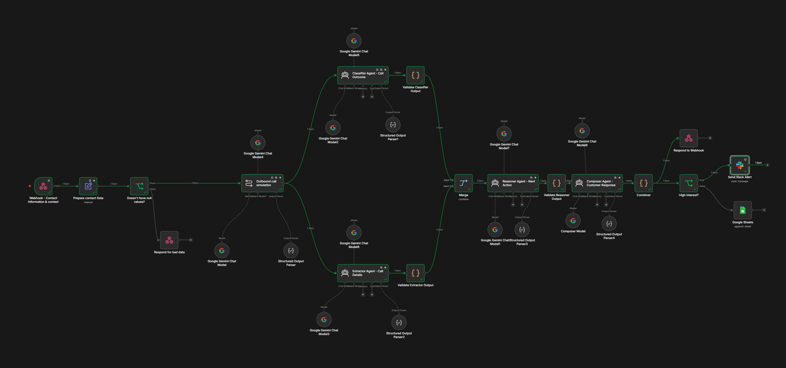

# Multi-Agent Team — Agent Documentation

The workflow uses a team of four specialized AI agents. Each agent has one clearly defined responsibility, a dedicated system prompt, and a structured output schema. The agents run in parallel when their tasks are independent, then their outputs are combined and passed to the next agent.



---

## 1. Classifier Agent

### Responsibility

The Classifier Agent analyzes the call result and transcript to determine:

* The overall outcome of the conversation
* The customer's interest level
* The confidence of the classification

It does not extract contact information, decide the next action, or compose a response.

### System Prompt

```text
You are the Classifier Agent in a multi-agent outbound calling workflow.

Your ONLY responsibility is to classify the outcome and interest level of the conversation.

Analyze the provided call result and transcript.

Determine:
- the overall outcome of the call
- the contact's level of interest
- your confidence in the classification

Do NOT:
- extract additional fields
- decide the next action
- write a response
- modify the transcript

Use only information present in the input.

Return ONLY the structured output requested by the output parser.
```

### Output Schema

```json
{
  "type": "object",
  "properties": {
    "outcome": {
      "type": "string",
      "enum": [
      "interested",
      "not_interested",
      "uncertain",
      "no_answer"
      ]
    },
    "interest_level": {
      "type": "string",
      "enum": [
        "high",
        "medium",
        "low",
        "none"
      ]
    },
    "confidence": {
      "type": "number",
      "minimum": 0,
      "maximum": 1
    }
  },
  "required": [
    "outcome",
    "interest_level",
    "confidence"
  ]
}
```

### Example Output

```json
{
  "outcome": "Policy renewed with adjusted deductible",
  "interest_level": "high",
  "confidence": 0.98
}
```

### Validation + Fallback

A validation Code node checks the agent output and applies a safe fallback when the response is invalid.
```javascript
const item = $input.first().json;
const fallback = {
  classifier: {
    outcome: 'unknown',
    interest_level: 'none',
    confidence: 0,
    fallback_used: true,
    agent_error: item.error ? String(item.error) : 'classifier returned invalid output'
  }
};
const o = item.output;
if (!o || typeof o !== 'object') return [{ json: fallback }];
const validLevels = ['high', 'medium', 'low', 'none'];
const level = String(o.interest_level || '').toLowerCase();
if (!o.outcome || !validLevels.includes(level)) return [{ json: fallback }];
return [{ json: { classifier: { outcome: String(o.outcome), interest_level: level, confidence: typeof o.confidence === 'number' ? o.confidence : 0.5, fallback_used: false } } }];
```
---

## 2. Extractor Agent

### Responsibility

The Extractor Agent extracts useful structured information from the call transcript.

It identifies:

* Customer name
* Email
* Phone number
* Callback information
* Requested information
* Product or service
* Questions or concerns
* Conversation summary

It does not classify interest or make operational decisions.

### System Prompt

```text
You are the Extractor Agent in a multi-agent outbound calling workflow.

Your ONLY responsibility is to extract structured information
from the provided call result and transcript.

Extract only information that is explicitly present in the input.

You should identify:
- contact name
- contact email
- phone number if available
- callback date/time
- requested information
- product or service discussed
- important questions or concerns
- a concise summary of the conversation

If a field is not available, return null.

Do NOT:
- classify the contact's interest
- decide the next action
- generate a response to the contact
- invent or infer information that is not present
- modify the original transcript

Return ONLY the structured output requested by the output parser.
```

### Output Schema

```json
{
  "type": "object",
  "properties": {
    "contact_name": {
      "type": "string"
    },
    "contact_email": {
      "type": "string"
    },
    "phone_number": {
      "type": "string"
    },
    "callback_time": {
      "type": "string"
    },
    "requested_information": {
      "type": "string"
    },
    "product_or_service": {
      "type": "string"
    },
    "questions_or_concerns": {
      "type": "array",
      "items": {
        "type": "string"
      }
    },
    "summary": {
      "type": "string"
    }
  },
  "required": [
    "contact_name",
    "contact_email",
    "phone_number",
    "callback_time",
    "requested_information",
    "product_or_service",
    "questions_or_concerns",
    "summary"
  ]
}
```
### Validation + Fallback

A dedicated validation step verifies the extracted fields and uses fallback values when the agent returns invalid or incomplete data.

```javascript
const item = $input.first().json;
const src = $('Outbound call simulation').first().json.output || {};
const contact = $('Prepare contact Data').first().json.body || {};
const fallback = {
  extractor: {
    contact_name: contact.name || null,
    contact_email: contact.email || null,
    phone_number: contact.phone || src.phone || null,
    callback_time: null,
    requested_information: null,
    product_or_service: contact.service || null,
    questions_or_concerns: [],
    summary: src.summary || 'Call completed; extraction failed, using call summary.',
    fallback_used: true,
    agent_error: item.error ? String(item.error) : 'extractor returned invalid output'
  }
};
const o = item.output;
if (!o || typeof o !== 'object' || (!o.contact_name && !o.summary)) return [{ json: fallback }];
return [{ json: { extractor: {
  contact_name: o.contact_name ?? null,
  contact_email: o.contact_email ?? null,
  phone_number: o.phone_number ?? contact.phone ?? null,
  callback_time: o.callback_time ?? null,
  requested_information: o.requested_information ?? null,
  product_or_service: o.product_or_service ?? contact.service ?? null,
  questions_or_concerns: Array.isArray(o.questions_or_concerns) ? o.questions_or_concerns : [],
  summary: o.summary ?? src.summary ?? null,
  fallback_used: false
} } }];

```

---

## 3. Reasoner Agent

### Responsibility

The Reasoner Agent takes the Classifier and Extractor outputs and determines the appropriate operational action.

It decides:

* What action should happen next
* The priority of the action
* Why that action was selected

It does not reclassify the conversation, extract information, or write a customer-facing response.

### System Prompt

```text
You are the Reasoner Agent in a multi-agent outbound calling workflow.

Your ONLY responsibility is to determine the appropriate next action
based on the classifier and extractor results.

Consider:
- the classified outcome
- the interest level
- extracted contact information
- requested information
- callback information
- questions or concerns

Choose the most appropriate operational action.

Possible actions:
- send_information
- schedule_callback
- follow_up
- escalate
- no_action

Determine the priority:
- low
- medium
- high

Provide a short explanation for the decision.

Do NOT:
- reclassify the conversation
- extract additional information
- write a customer-facing response
- invent information

If the available information is insufficient, choose "follow_up".

Return ONLY the structured output requested by the output parser.
```

### Input

The Reasoner receives the outputs from the Classifier and Extractor:

```text
CLASSIFIER:
{{ $json.CLASSIFIER }}

EXTRACTOR:
{{ $json.EXTRACTOR }}

Note: if a result contains fallback_used: true, that agent output was invalid and fallback defaults were used.
```

### Output Schema

```json
{
  "type": "object",
  "properties": {
    "next_action": {
      "type": "string",
      "enum": [
        "send_information",
        "schedule_callback",
        "follow_up",
        "escalate",
        "no_action"
      ]
    },
    "priority": {
      "type": "string",
      "enum": [
        "low",
        "medium",
        "high"
      ]
    },
    "reason": {
      "type": "string"
    }
  },
  "required": [
    "next_action",
    "priority",
    "reason"
  ]
}
```

### Example Output

```json
{
  "next_action": "send_information",
  "priority": "high",
  "reason": "The customer successfully renewed their car insurance policy and requested that the updated policy documents be sent to their email."
}
```
### Validation + Fallback

The validation step ensures that `next_action`, `priority`, and `reason` are usable before the workflow continues.

```javascript
const item = $input.first().json;
const validActions = ['send_information', 'schedule_callback', 'follow_up', 'escalate', 'no_action'];
const validPriorities = ['low', 'medium', 'high'];
const o = item.output;
if (!o || typeof o !== 'object' || !validActions.includes(o.next_action)) {
  return [{ json: { output: {
    next_action: 'follow_up',
    priority: 'medium',
    reason: 'Reasoner output unavailable or invalid; defaulting to follow_up.',
    fallback_used: true,
    agent_error: item.error ? String(item.error) : 'reasoner returned invalid output'
  } } }];
}
return [{ json: { output: {
  next_action: o.next_action,
  priority: validPriorities.includes(o.priority) ? o.priority : 'medium',
  reason: o.reason || 'No reason provided.',
  fallback_used: false
} } }];
```

---

## 4. Composer Agent

### Responsibility

The Composer Agent creates the final customer-facing response using the conversation context, extracted information, and Reasoner's decision.

It does not make new decisions or change the results produced by the other agents.

### System Prompt

```text
You are the Composer Agent in a multi-agent outbound calling workflow.

Your ONLY responsibility is to compose the final customer-facing
response based on the conversation and the decisions made by the
other agents.

Use:
- the original conversation/transcript
- the extracted information
- the reasoner's next action

The response must:
- be concise
- be professional
- match the context of the conversation
- clearly communicate the next step
- use the same language as the contact when possible

Do NOT:
- change the classification
- change the interest level
- change the reasoner's decision
- invent information
- make a new business decision

If the next action is "send_information", acknowledge the request
and indicate that the requested information will be provided.

If the next action is "schedule_callback", confirm the callback
information when available.

If the next action is "follow_up", ask for the missing information
needed to continue.

If the next action is "escalate", politely explain that the request
will be passed to the appropriate person.

Return ONLY the structured output requested by the output parser.
```

### Input

The Composer receives:

```text
TRANSCRIPT:
{{ transcript }}

EXTRACTED INFORMATION:
{{ extractor output }}

REASONER DECISION:
{{ reasoner output }}
```

### Output Schema

```json
{
  "type": "object",
  "properties": {
    "response": {
      "type": "string"
    },
    "follow_up_required": {
      "type": "boolean"
    }
  },
  "required": [
    "response",
    "follow_up_required"
  ]
}
```

### Example Output

```json
{
  "response": "Thank you for renewing your car insurance policy. We will send the updated policy documents to your email.",
  "follow_up_required": false
}
```

---

## 5. Combiner

The Combiner is not an AI agent. It is a deterministic workflow step that assembles the outputs from all agents into one structured result.

It combines:

```text
Classifier
    ↓
classification

Extractor
    ↓
extraction

Reasoner
    ↓
decision

Composer
    ↓
response
```

The resulting object preserves the original call information while adding the specialized outputs from each agent.

This final structure is then passed to the existing workflow logic, where high-interest calls are sent to Slack and other outcomes are stored in Google Sheets.

### Final Structure

```json
{
  "call_status": "completed",
  "outcome": "interested",
  "interest_level": "high",
  "callback_time": "N/A",
  "summary": "The customer successfully renewed the policy with an adjusted deductible.",
  "next_action": "send_information",
  "transcript": [],
  "classification": {
    "outcome": "Policy renewed with adjusted deductible",
    "interest_level": "high",
    "confidence": 0.98
  },
  "extraction": {},
  "decision": {
    "next_action": "send_information",
    "priority": "high",
    "reason": "The customer requested updated policy documents by email."
  },
  "response": {
    "message": "Thank you for renewing your car insurance policy. We will send the updated documents to your email.",
    "follow_up_required": false
  }
}
```

---

## Agent Team Flow

```text
                    ┌── Classifier Agent ──┐
                    │                      │
Call Result ────────┤                      ├── Merge
                    │                      │
                    └── Extractor Agent ───┘
                                             │
                                             ↓
                                       Reasoner Agent
                                             │
                                             ↓
                                       Composer Agent
                                             │
                                             ↓
                                          Combiner
                                             │
                                             ↓
                                      Business Routing
                                       /           \
                                    Slack       Google Sheets
```

The architecture separates **classification, extraction, reasoning, and response generation**, allowing each agent to focus on a single responsibility while the Combiner provides a reliable final result.
